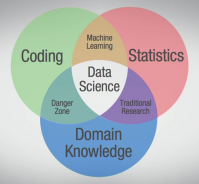

# Big Data

http://www.lynda.com/Hadoop-tutorials/Techniques-Concepts-Big-Data/158656-2.html

- Introduction

- Welcome

1. What Is Big Data?
    - The three Vs of big data
        - Volume
        - Velocity
        - Variety
    - Does big data need all three?

2. How Is Big Data used? 
    - Understanding big data for consumers
    - Understanding big data for business
    - Understanding big data for research

3. Big Data and Data Science
    - Ten ways big data is different from small data
        1. Goals 
        2. Location
        3. Data Structure
        4. Data Preparation
        5. Longevity
        6. Measurements
        7. Reproducibility
        8. Stakes
        9. Introspection
        10. Analysis
    - The three facets of data science
    

    
    

    - Types and skills in data science
    - Data science without big data
    - Big data without data science
    
4. Ethics in Big Data
    - Challenges with anonymity
    - Challenges with confidentiality
    
5. Sources and Structures of Big Data
    - Human-generated data
    - Machine-generated data
    - Structured data
    - Unstructured data
    
6. Storing Big Data
    - Distributed storage and the cloud
    - Cloud computing: IaaS, PaaS, SaaS, and DaaS
    - A brief introduction to Hadoop
        - MapReduce
        - Pig
        - Hive
        - HBase
        - Storm
        - Spark
        - Giraph

7. Preparing Data for Analysis
    - Challenges with data quality
    - ETL: Extract, transform, load
    - Additional Vs of big data
        - Volume, Velocity, Variety
        - Veracity, Validity, Value,Variability 
        - Venue, Vocabulary, Vagueness

8. Big Data Analysis
    - Monitoring and anomaly detection
    - Data mining and text analytics
    - Predictive analytics
        - kaggle.com
    - Big Data Visualization
    - The role of Excel in big data

- Conclusion
    - Next steps